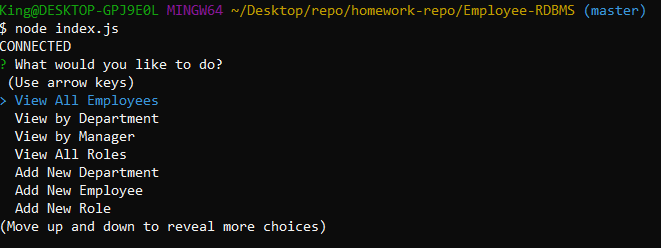

  # Employee-RDBMS

  

  ## Table of Contents

* [Description](#description) 

* [Installation](#installation) 

* [Usage](#usage) 

* [Contributing](#contributing) 

* [Test](#test) 

* [License](#license) 

* [Questions](#questions) 

  ## Description:
  
  This app is a database management system that allows users to view, add, update, and remove employee data. This is done by accessing a connection to a MySQL server, inquiring with the user, and modifying data in the database. One thing to note is that it is a CLI app. It's use is meant for command lines and terminals. Commands will be used to operate this. For a tutorial of how the app works click [here](https://www.youtube.com/watch?v=oQ5A-X3AnkA&t=5s&ab_channel=KingTing).
  ## Installation: 
  To install dependencies use:
    
      npm install 
      npm install mysql
      npm install inquirer
      
  ## Usage:
  To use the app make sure your MySQL server is running, install dependencies as stated above. Then run the app using the cmd:
      
      node index.js
        
  ## Contributing: 
  No contributors
  ## Test: 
  N/A
  ## License:  

  This project is protected under the [MIT](https://opensource.org/licenses/MIT) license. Use is encouraged as outlined in this license.

  ## Questions: 
  For questions about the project go to my GitHub page at:

  [GitHub Profile](https://github.com/Nardacyon)
